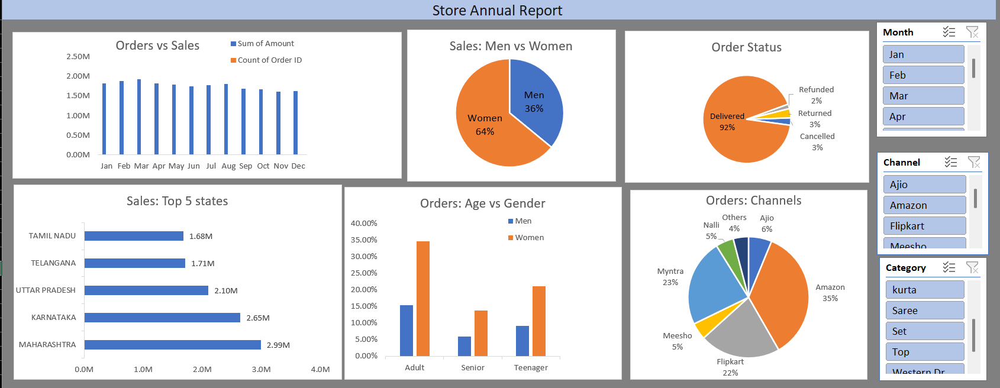

# Store Data Analysis – Excel Dashboard

## Overview

An Excel-based data analysis project to explore store sales and order performance across customer demographics, product categories, sales channels, order status, and states.

## Tools & Techniques

* Microsoft Excel
* Data Cleaning
* Pivot Tables
* Pivot Charts
* Slicers
* Data Visualization
* Sales & Order Analysis

## Dashboard

## Key Analysis

* Analyzed **31,047 transaction records** to understand sales and order patterns.
* Compared sales performance across **gender, age groups, product categories, sales channels, and states**.
* Analyzed **monthly sales trends** and order status.
* Identified **top-performing products, channels, and states** using Pivot Tables and visualizations.

## Key Findings

* Women contributed a higher share of sales than men.
* Amazon recorded the highest sales among the analyzed sales channels.
* Set was the highest-selling product category.
* Maharashtra recorded the highest sales among the states.
* March recorded the highest monthly sales.

## File

* `Store Data Analysis.xlsx` – Excel workbook containing the analysis and dashboard.

